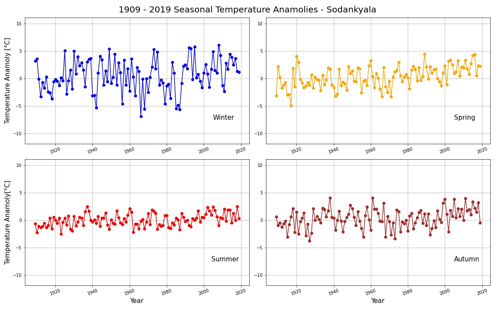

# About this repository
A mini introduction to the programming basics and scientific data analysis using python. The python libraries pandas and matplotlib will be used for reading, maupulating, analyzing and plotting data. It follows an example case where we go through different steps of processing involving different functions of python, pandas and matplotlib libraries/modules.

# Pre-requisites for these exercises

1. Basic Knowledge of python
2. Basic Knowledge of pandas
3. Basic Knowledge of matplotlib

# Exercise-1
The `pandas` and `matplotlib` folder contains the required data, produced outputs and a jupyter notebook file with the code explained in detail how the different steps are performed which include:

1. Importing the necessary modules
2. Using functions, `for` loops and conditional statements
3. Pandas dataframe operations like:
    1. Creating, reading & writing 
    2. Indexing, selecting & Assigning
    3. Grouping & sorting
    4. Datatypes & missing values
    5. Renaming & combining
4. Matplotlib.pyplot library functions like:
    1. Creating different kinds of plots
    2. Creating sub-plots
    3. Basic plot-formatting
    4. Saving the plots 

## Goal for exercise-1
The goal of this exercise is to calculate and plot seasonal weather anomalies to see how temperatures have changed in different seasons over the past 100+ years. The data used for this exercise is from the Sodankyla weather station of Finland.

### What are temperature anamolies?
A temperature anomaly is the difference from an average, or baseline temperature. A positive anomaly indicates the observed temperature was warmer than the baseline, while a negative anomaly indicates the observed temperature was cooler than the baseline. [Source](https://www.ncdc.noaa.gov/monitoring-references/dyk/anomalies-vs-temperatureS) 

**The final output is to create a four-panel plot showing the seasonal temperature anomalies for winter, spring, summer, and autumn for the years 1909-2019.** 

The subplot at the end looks like the below picture



## Data
The [data](exercise-1/data/2315676.txt) used for the exercise-1 is the daily temperature data of Sodankyla weather station of Northern Finland. It contains daily temperature data from January 1908 till October 2020.

As shown below, there are a total of 6 columns in the data. Here the `TAVG`, `TMAX`, `TMIN` are in degree fahranheit. 

```
STATION           STATION_NAME          DATE     TAVG     TMAX     TMIN      
```

A description of the columns are given below:

- `STATION` : this is the value of staion ID where the daily temperatures are recorded.
- `STATION_NAME` : this is the name of the station from where the daily temperatures are recorded.
- `DATE` : this indicates the timestamp which is in `YEARMODA` format. Here **YEAR** is the year, **MO** is the month and **DA** is the day. It means the first four numbers indicate the YEAR, the next two digits indicate the month and the last two digits indicate the day. For example `19080101` indicates 1908 Year, January month (01) and 1st day of the month (01).
- `TAVG` : this indicates the average daily temperature in fahranheit
- `TMAX` : this indicates the maximum daily temperature in fahranheit
- `TMIN` : this indicates the minimum daily temperature in fahranheit

The **missing data** are labelled as `-9999` in the data. 

## Overview of tasks for exercise-1

1. Reading, cleaning and preparing the data.

2. Convering temperatures from fahranheit to celsius

3. Calculating seasonal average temperature for each season in every year from **1909 till 2019**

    ```
    Winter 1909   Spring 1909   Summer 1909   Autumn 1909
    Winter 1910   Spring 1910   Summer 1910   Autumn 1910
    Winter 1911   Spring 1911   Summer 1911   Autumn 1911
    .
    .
    ```
    - The seasons are defined as follows:
        - **Winter**: December, January, Febraury
        - **Spring**: March, April, May
        - **Summer**: June, July, August
        - **Autumn**: September, October, November
        
4. Calculating seasonal average temperature for the reference period which is **1951 - 1980**

5. Calculating seasonal temperature anamolies

6. Plotting the data